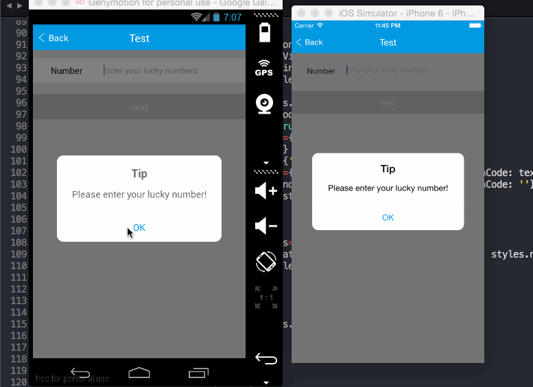

# react-native-popup  
[](https://www.npmjs.com/package/@zzzkk2009/react-native-popup)  

This is a custom component for React Native, a simple popup, compatible with ios and android.

###Demo


### Methods
- <b>alert</b>(<b>`message`</b>: *string*|*number*, [...]) 
```javascript
	e.g.

		Popup.alert(1);

		Popup.alert(1, 'two', '10 messages at most');
```
- <b>tip</b>({ <b>`title`</b>: *string*, <b>`content`</b>: *string*|*number*|*array*<*string*|*number*> *`isRequired`*, <b>`btn`</b>: {<b>`title`</b>: *string* <b>*`default 'OK'`*</b>, <b>`callback`</b>: *function*}, }) 
```javascript
	e.g.

		Popup.tip({
			content: 'come on!',
		});

		Popup.tip({
			title: 'TipTip',
			content: 'come on!',
		});

		Popup.tip({
			content: ['come on!', 'go!'],
			btn: {
				text: 'OKOK',
				style: {
					color: 'red'
				},
				callback: () => {
					this.popup.alert('over!');
				},
			},
		});
```
- <b>confirm</b>({ <b>`title`</b>: *string*, <b>`content`</b>: *string*|*number*|*array*<*string*|*number*> *`isRequired`*, <b>`ok`</b>: {<b>`title`</b>: *string* *`default 'OK'`*, <b>`callback`</b>: *function*}, <b>`cancel`</b>: {<b>`title`</b>: *string* *`default 'Cancel'`*, <b>`callback`</b>: *function*}, }) 
```javascript
	e.g.

		Popup.confirm({
			content: 'Are you ready?',
		});

		Popup.confirm({
			content: 'Are you ready?',
			ok: {
				callback: () => {
					this.popup.alert('Very good!');
				},
			},
		});

		Popup.confirm({
			title: 'title',
			content: ['come on!', 'go!'],
			ok: {
				text: 'Y',
				style: {
					color: 'red'
				},
				callback: () => {
					this.popup.alert('Good!');
				},
			},
			cancel: {
				text: 'N',
				style: {
					color: 'blue'
				},
				callback: () => {
					this.popup.alert('Hurry up！');
				},
			},
		});
```

###Usage
####Step 1 - install

```
	npm install @zzzkk2009/react-native-popup --save
```

####Step 2 - import and use in project

```javascript
import Popup from '@zzzkk2009/react-native-popup';

class App extends React.Component{

	onPressHandle() {
		// alert
		Popup.alert(1);
	},

	render() {
		return (
			<View style={styles.container}>

				<Text style={styles.btn} onPress={this.onPressHandle.bind(this)}>click me !</Text>

			</View>
		);
	},
	
};
```